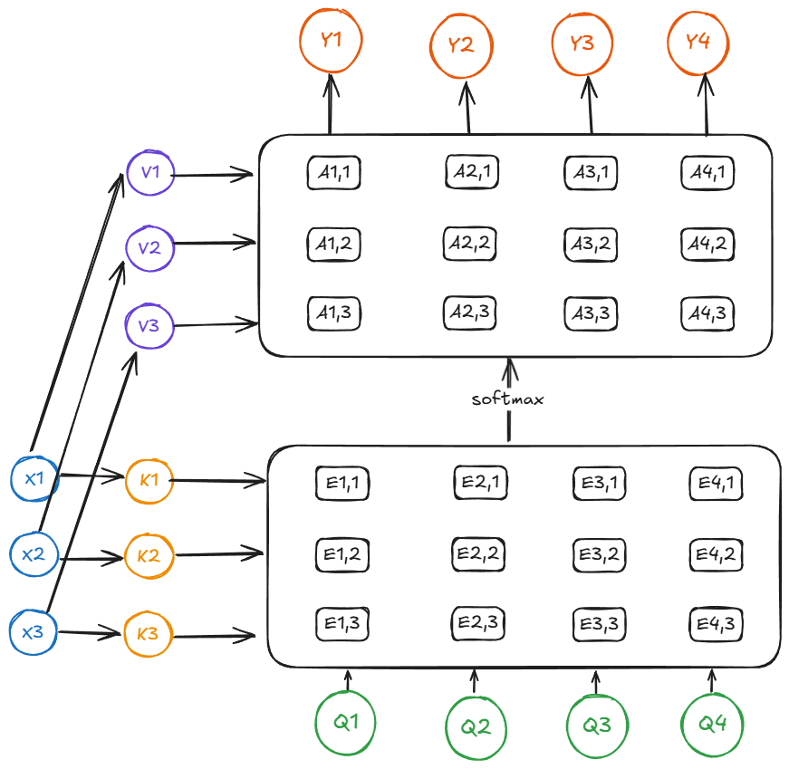
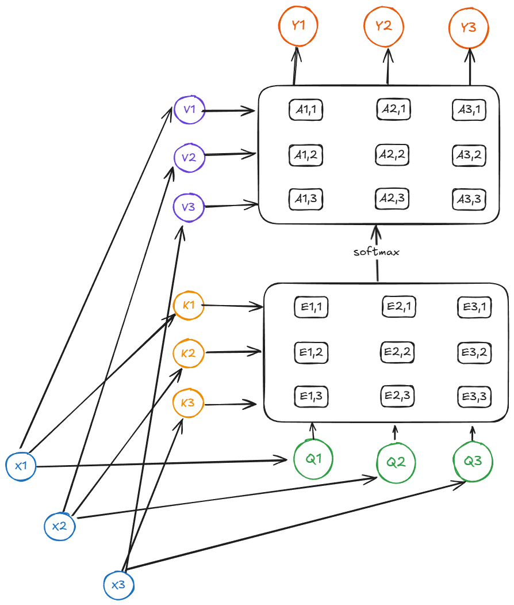
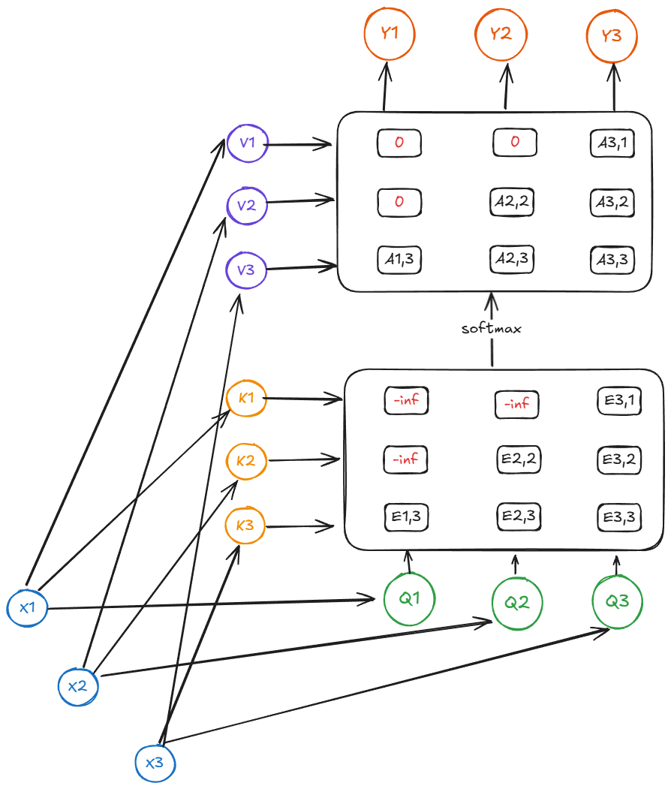
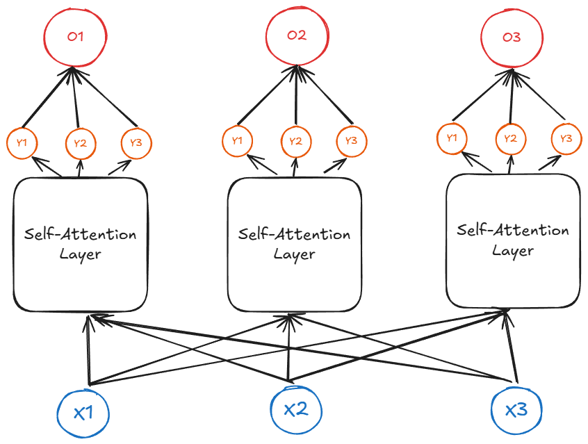

# Attention

## RNN Machine translation

Recall the Machine translation RNN model:

We have an input sequence $(x_1, \dots, x_T)$. 
- In the encoder step, we construct hidden states $(h_1, \dots, h_T)$ where $h_t = f_W(x_t, h_{t-1})$.
- Using the final hidden state, we create a context vector $c = f(h_T)$ (since $h_T$ encodes the information from the entire sequence due to the recurrent nature).
- Given an initial decoder state $s_0$, we create a recurrent decoder network $s_t = g_U(y_{t-1}, s_{t-1}, c)$. 
- We can map each decoder state $s_t \to y_t$ using a softmax over a dictionary.

## RNN Attention

**Problem: Input sequence bottlenecks through the fixed size c.**

Even as our number of states increase, our context vector has a fixed size. Our network will not scale to huge vectors.

To address this, we want to look back at the whole input sequence on each step of the output!

- The initial setup is the same. We start with an input sequence $(x_1, \dots, x_T)$ that is encoded into a set of hidden states $(h_1, \dots, h_T)$.
- For each decoder state $(s_t)$, we will compute scalar alignment scores $e_{t,i} = f_{att}(s_{t-1}, h_i)$ (where $f_{att}$ is a linear layer).
- Apply a softmax to bound the scores between $a_{t, i} \in [0, 1]$.
- Our context vector at step $t$ is defined as $c_t = \sum_{i=1}^T a_{t, i} h_i$.
- Finally, use the context vector in the decoder: $s_t = g_U(y_{t-1}, s_{t-1}, c_t)$.

Now, every step in the decoder has a view over the entire input sequence.

## General Attention operator

Attention proves to be a more general neural network primitive that is useful beyond sequence-to-sequence modeling.
 
In the RNN case:
- We have encoder RNN states that represent data vectors.
- We have decoder RNN states that represent query vectors.
- The context vector is formed by attending all the data vectors. This will be referred to as the output vector.

To generalize this:
- Inputs: query vectors $Q \in R^{N_Q \times D_Q}$, data vectors $X \in R^{N_X \times D_Q}$. 
- Define learnable weight matrices $W_K \in \R^{D_X \times D_Q}$ and $W_V \in \R^{D_X \times D_V}$. We will have keys $K = XW_K \in \R^{N_X \times D_Q}$ and values $V = XW_V \in \R^{N_X \times D_V}$.
- The similaries are defined using a scaled dot product: $E = QK^\top / \sqrt{D_Q}$.
    - The scaling factor helps avoid vanishing gradients as the dimension grows (since the dot product will scale with the dimension). 
- The attention matrix $A = \text{softmax}(E, \dim = 1) \in \R^{N_Q \times N_X}$.
- The output $Y = AV \in \R^{N_Q \times D_X}$.
This is known as a cross-attention layer: we are cross attenting between two sets of things.

### Self attention

Previously, we mapped $X$ into a key and value matrix $K$, $V$. We can also map the query vectors $X \to Q$! This is known as self-attention:

In practice, we group the matrices together for better performance on hardware: $$[Q, K, V] = X[W_Q, W_K, W_V].$$

This would be the decoder-only attention, which is the most common flavor of attention.

One interested property of the self-attention layer is that it is equivariant with respect to permutations: $F(\sigma(X)) = \sigma(F(X))$. If we want to preserve position, we can append a positional embedding onto the input.

### Masked Self-attention

For some problems, we might want to impose structure on the computation so that certain pieces of the input are only allowed to reference certain other pieces of the network.

After calculating the alignment scores $E$, we override the scores with $-\infty$ in places where we want to block the attention:

### Multiheaded Self-attention
The typical flavor of transformers nowadays. In order to scale the number of parameters of the network, we pass the inputs into separate self-attention blocks. The outputs of each self-attention block are concatenated into a single output per block.

## Sequence processing overview

We have three ways of processing sequences:

- Recurrent networks
    - Works on $1D$ ordered sequences
    - Pros: 
        - Theoretically good at long sequences, $\mathcal O(N)$ compute and memory for sequence of length $N$
    - Cons:
        - Not parallelizable, since we need to compute hidden states sequentially.
        - Poor performance on long sequences since all the information is encoded into a single state.
- Convolutional networks
    - Works on $N$-dimensional grids
    - Pros:
        - Parallelizable, outputs can be computed in parallel
    - Cons:
        - Bad for long sequences: need to stack many layers to build up large receptive fields
- Self-attention
    - Works on sets of vectors
    - Pros: 
        - Great for long sequences, each input depends directly on all inputs
        - Highly parallelizable
    - Cons:
        - Expensive: $\mathcal O(N^2)$ compute, $\mathcal O(N)$ memory for a sequence of length $N$.