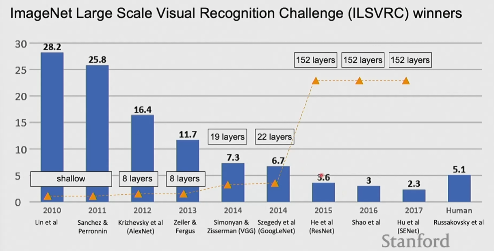
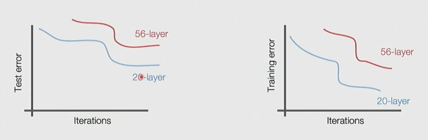
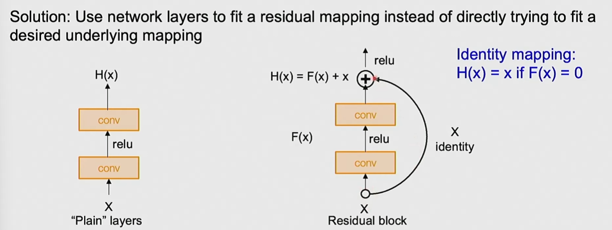

# ImageNet Visual Recognition Challenge

The first time we significantly improved over human performance, we had significantly more layers.

## ResNet

What happens when we stack deeper layers on a CNN network? It should at least contain the representational power.

But in practice, shallower networks tend to perform better. And it is not caused by overfitting.

**Hypothesis: Deeper models are harder to optimize**

Consider a deep model with two Conv layers. In order to learn a shallow model with one layer, it needs to learn the identity mapping or one of the layers.

### Skip connections

An easier way to acoomplish this: add a skip connection so that the model can more easily learn $H(x) = x$.

