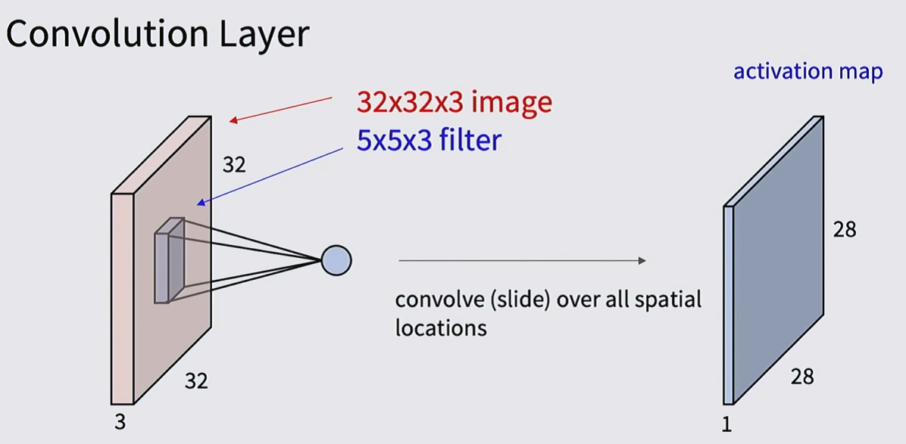

# Convolutional Neural Networks (CNNs)

Recall our fully-connected networks, 
$$\text{Linear:}\quad f = Wx$$
$$\text{2-layer NN:} \quad f = W_2\max(0, W_1x)$$

Suppose we start with an image $x \in \R^{32 \times 32 \times 3}$. For both of these networks, we are forced to flatten the image into a row vector $x \in \R^{3072}$. This loses all of the spatial structure!

Nowadays, vision transformers are preferred to ConvNets, but these were very popular from 2011 - 2020.

## Intuition

Start with a image 3-tensor $x \in \R^{32 \times 32 \times 3}$ and take a filter $w \in \R^{5 \times 5 \times 3}$.

Every time we calculate a convolution, we have a resulting activation map, each of which have dimension $(1, 28, 28)$. 

If we repeat this process with a new filter $w_2$, we'll have a another activation map. And we can repeat this as many times as we want.

