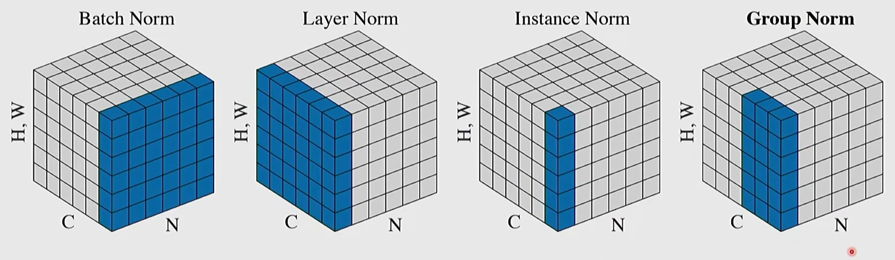

## Normalization Layers

High-level: learn parameters that let us scale/shift the input data.
1. Normalize the input data
2. Scale / shift using the learned parameters

All of the norms work the same way: $X \in \R^{N \times D}$.

$$X \to \hat X \to y,$$
where $$\hat X = \frac{X - \mu}{\sigma}, \quad y = \gamma \hat X + \beta$$

The difference is the way that we transform $X \to \hat X$.

### Batch Norm 
**Normalize each feature across the batch.**

For each feature index $d$,
$$\mu_d = \frac{1}{N} \sum_{n=1}^N X_{n, d}, \qquad \sigma^2_d = \frac{1}{N}\sum_{n=1}^N (X_{n, d} - \mu_d)^2$$

- Each column (feature) is normalized independently.
- Uses batch statistics -> changes if the batch size is small.

### Layer norm
**Normalize each sample across its feature dimension.**

For each sample $n$,
$$\mu_n = \frac{1}{D} \sum_{d=1}^D X_{n, d}, \qquad \sigma^2_n = \frac{1}{D}\sum_{d=1}^D (X_{n, d} - \mu_d)^2$$

- Normalize each row (feature vector) for the sample
- Independent of batch size -> preferred approach for transformers
