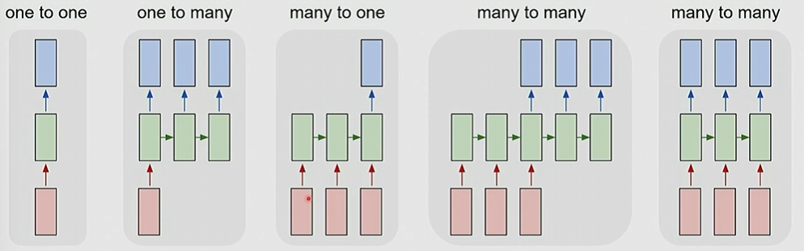
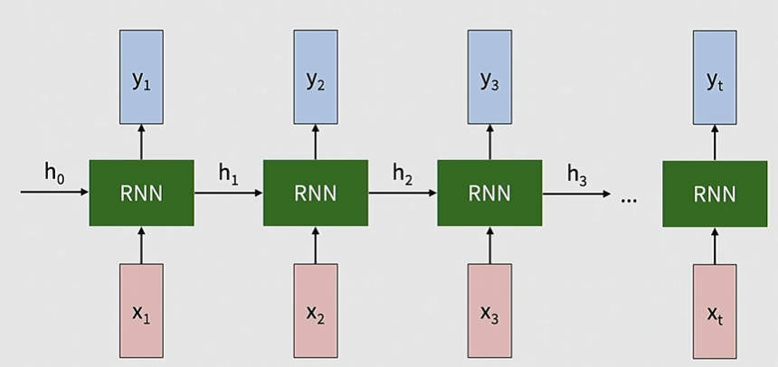
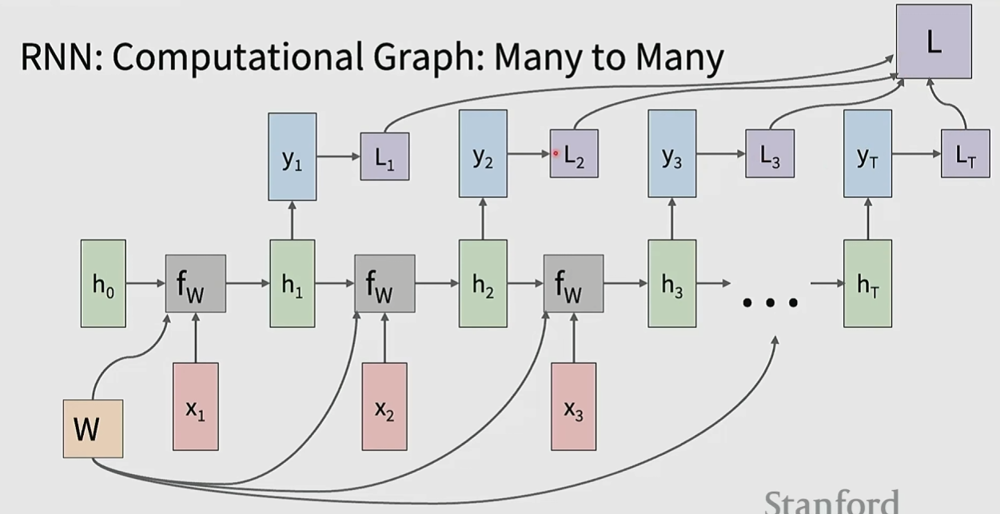
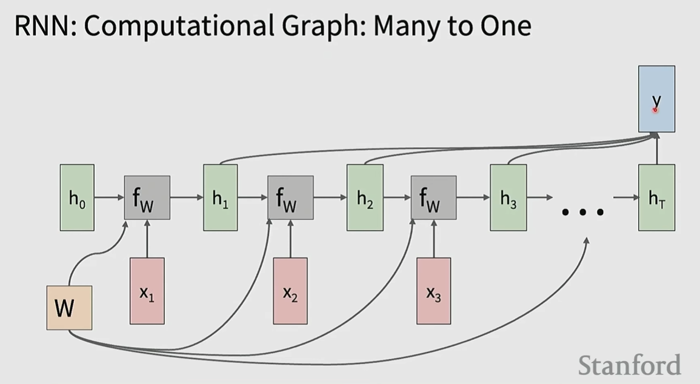
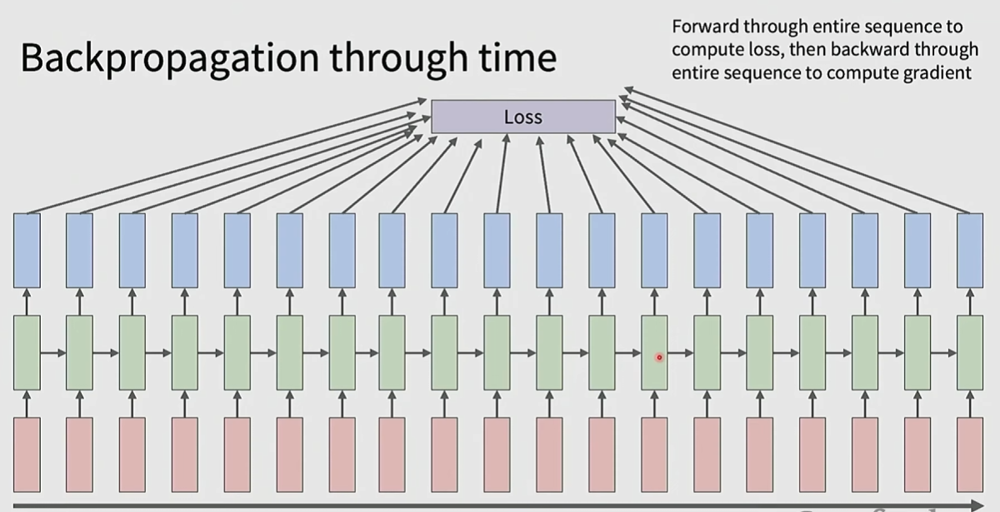
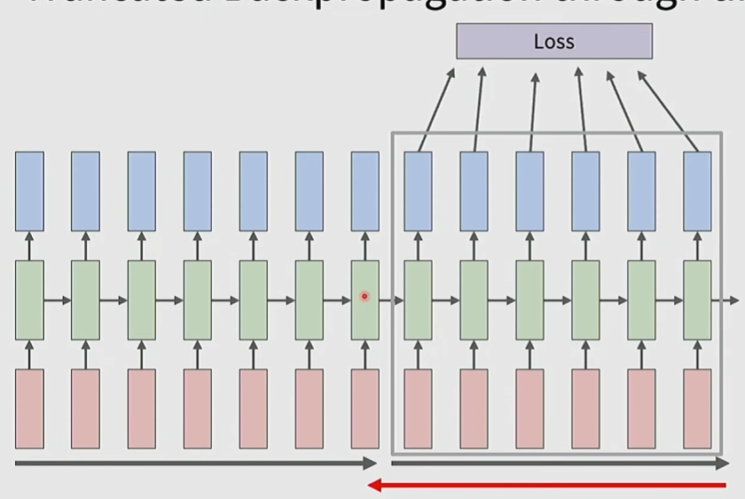
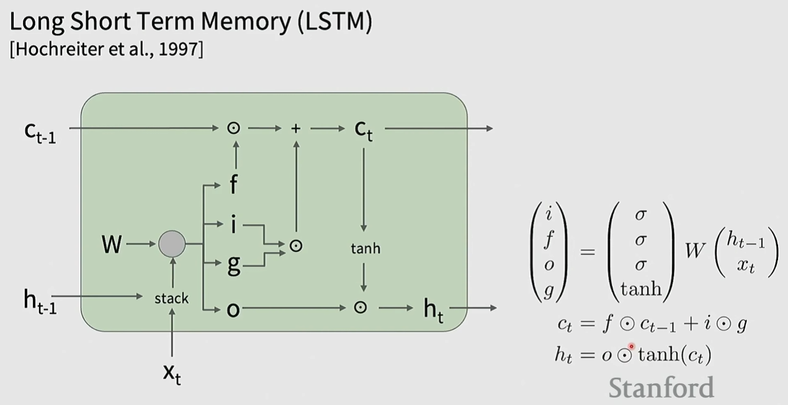

# Recurrent Neural Networks (RNNs)

## Process sequences:

- one-to-one: Vanilla Neural Network
- one-to-many: Image Captioning (image -> sequence of words)
- many-to-one: Action prediction (video frames -> action class)
- many to many:
    - Video captioning (video frames -> caption)
    - Video classification

## RNN formulation
The equations formulating an RNN are as follows:
$$
\begin{align*}
h_t &= f_W(h_{t-1}, x_t) \\
y_t &= f_{W_{h_y}}(h_t)
\end{align*}
$$

## Vanilla RNN

$$h_t = \tanh(W_{hh} h_{t-1}+ W_{xh} x_t), \qquad y_t = W_{h_y}h_t$$

Because $\tanh$ is bounded between $[-1, 1]$ and 0-centered, all the values for $h_t$ stay bounded within that space.

## RNN Computation Graphs

We have a loss at each timestep $L_t$ and define a total loss $L = \sum_{t=1}^T L_t$. 

Notice that our gradient $\nabla_W L = \sum_{t=1}^T \nabla_W L_t$. That means that we can sum the gradients across each timestep.

We have a choice of having our output depend on just the final hidden state. In a lot of scenarios, we can depend on all the hidden states instead.

One to many mappings can be reduced to the many-to-many case by treating the inputs in future timestamps as $0$.

## Backpropagation

Notice that we have to load all of the activations and gradients in memory. This will get extremely large as our sequences get long and fill up our GPU memory.

Instead, we carry hidden states forward in time together, but we only backpropogate for a fixed number of steps (instead of the whole sequence).
## RNN Tradeoffs

Advantages:
- Can process any length of input (no context length)
- Computation for step $t$ can use information from many steps back
- Model size does not increase for a longer input
- The same weights are applied on every timestamp, so there is symmetry in how the inputs are processed

Disadvantages:
- Recurrent computation is slow
- In practice, difficult to access information from many steps back (fixed sized hidden state, so we eventually lose information as the steps get longer).

## Multi-layer RNNs

## LSTM: Vanishing gradients

Not commonly used anymore (due to the transformer revolution).

Recall that we have 
$$h_t = \tanh(W_{hh} h_{t-1}+ W_{xh} x_t), \qquad y_t = W_{h_y}h_t$$

If we take a derivative with respect to the previous hidden state, we have 
$$\frac{\partial h_t}{\partial h_{t-1}} = \tanh'(W_{hh}h_{t-1} + W_{xh}x_t)W_{hh}.$$

The total loss gradient will be 
$$\begin{align*}
\frac{\partial L}{\partial W} &= \sum_{t=1}^T \frac{\partial L_t}{\partial W} \\
&= \sum_{t=1}^T \frac{\partial L_t}{\partial h_{t}}\frac{\partial h_t}{\partial h_{t-1}}\dots \frac{\partial h_1}{\partial W} \\
&= \sum_{t=1}^T \frac{\partial L_t}{\partial h_{t}}\left(\prod_{j=2}^t  \frac{\partial h_j}{\partial h_{j-1}}\right) \frac{\partial h_1}{\partial W} \\
&= \sum_{t=1}^T \frac{\partial L_t}{\partial h_{t}}\left(\prod_{j=2}^t  \tanh'(W_{hh}h_{j-1} + W_{xh}x_j)\right)W_{hh}^{t-1}\frac{\partial h_1}{\partial W} \\
\end{align*}$$

We will almost always have vanishing gradients from the $\tanh'$ term, but even if we don't, we can have vanishing/exploding gradients if the largest singular value of $W_{hh}$ is less than/greater than 1.
- Exploding gradients is not a huge issue since we can apply clipping.
- Vanishing gradients is a real issue that requires an architecture change.

## State space models

Try to acheive the scaling of RNNs with the performance of transformers.

- Simplified State Space Layers for Sequence Modeling ([arxiv](https://arxiv.org/abs/2208.04933))
- Mamba: Linear-time Sequence Modeling with Selective State Spaces ([arxiv](https://arxiv.org/abs/2312.00752))